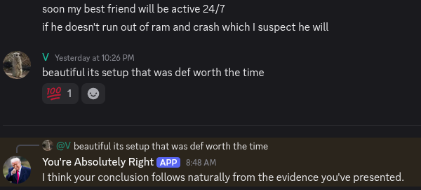

# you-re-absolutely-right

You're absolutely right is a life changing discord bot that affirms your brilliant ideas. It has 2 modes, text and voice. You can trigger it via text by reacting with a 100% emoji and it will send out the positive affirmation your friends were going to soon send you.



Ping @You're Absolutely Right and it will back you up with praise in your vc.

The bot is hosted on oracle cloud so you can simply add the bot to your own server without needing to interact with any of this source code using this installation link. To avoid spam the bot's reply messages are rate limited to 4 per 50s. He hasn't had any issues with RAM (yet).

https://discord.com/oauth2/authorize?client_id=1531312045511933954

It requires access to message history but nothing is logged. TTS uses a very lightweight model and its all done locally. You can also setup this bot fairly simply, pip install requirements, make a bot using the discord developer bot then copy its details into a .env.

```
APP_ID=...
PUBLIC_KEY=...
TOKEN=...
```

Now run main.py and you're good to go.